```{r xaringan-themer, include=FALSE}
# sds::duo_smith()
sds::mono_light_smith()
```

```{r setup, include=FALSE}
options(htmltools.dir.version = FALSE)
#source("~/Dropbox/BenAnalysis/BRFSS/brfss-lgbt-cg/code/sgmcg_wrangling_3.R")
#source("~/Dropbox/BenAnalysis/BRFSS/brfss-lgbt-cg/code/mhqol_models_2.R")
#source("~/Dropbox/BenAnalysis/BRFSS/brfss-lgbt-cg/code/state_data.R")
#setwd("~/Dropbox/BenAnalysis/BRFSS/brfss-lgbt-cg/Presentations")
```


# Why Caregivers?


<!------>

> There are four kinds of people in the world </br> Those who _have been_ caregivers. </br> Those who _are currently_ caregivers. </br> Those who _will be_ caregivers, and </br> Those who _will need_ a caregiver. </br> --Rosalynn Carter

---
class: middle, center

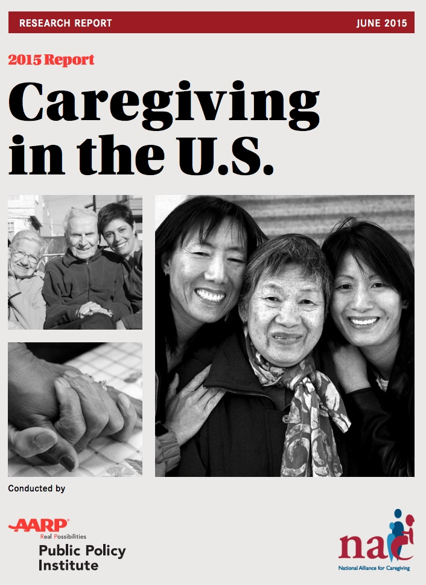


---
class: inverse, middle,
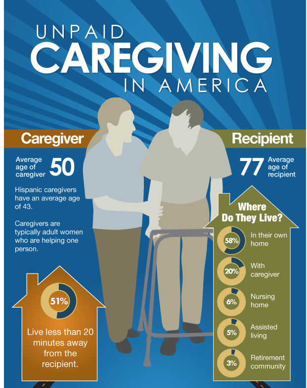
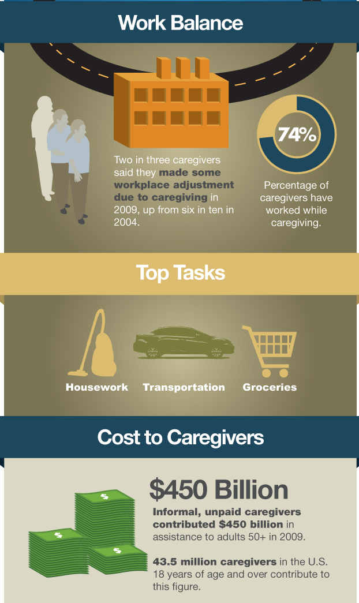

.footnote[[source] https://blog.aarp.org/2012/12/12/infographic-caregiving-in-america/_]
---

# Caregiving can be physically, emotionally, and financially challenging

## But it depends

---
class: inverse, middle, center

#No consistently asked questions about caregiving on federal surveys until 2015

---
class: inverse, middle, center

#State policies affect caregiving availability

---

# Caregiving is "women's work"

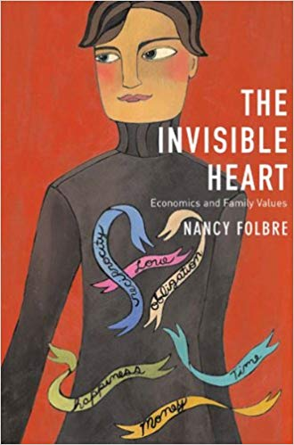
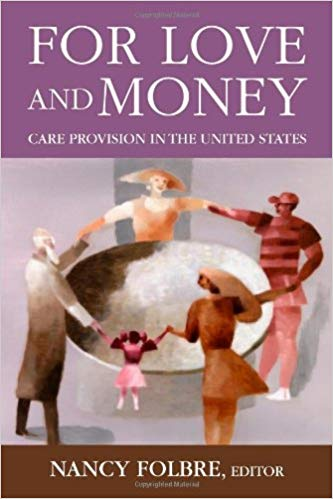

---
class: center
#Conceptual framework

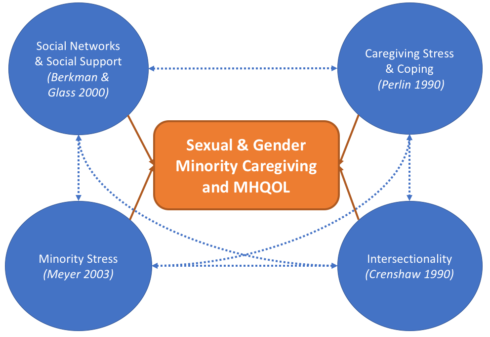

---
class: center
# Research Question 1 (Caregiving Prevalence)

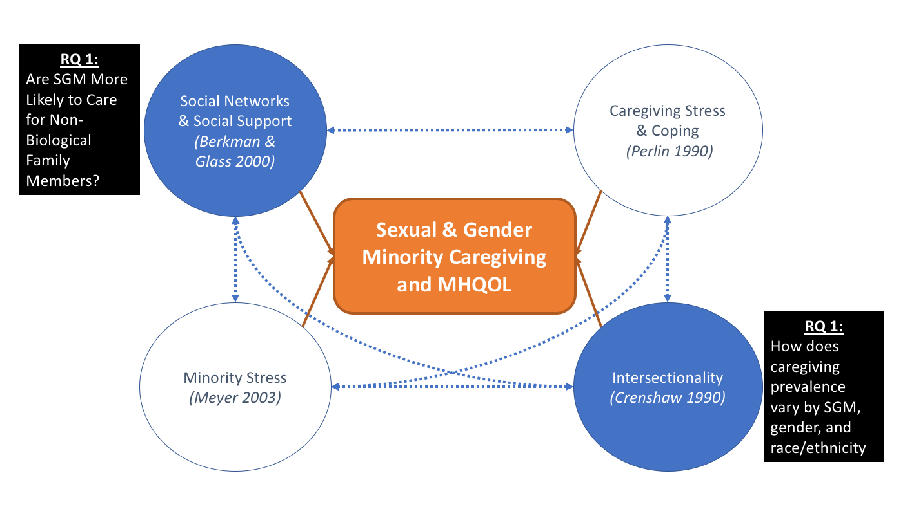

---

# Main Question

Are there differences among caregivers by sexual and gender identity?

- Amount or types of care they provide
- How caregiving affects their quality of life


---
class: inverse, middle, center
# Methods - Data


---
#Behavioral Risk Factor Surveillance System (BRFSS)

- Annual Telephone Survey in all 50 states (+ Territories), since 1984

- n ~ 400,000/year


---
# Caregiving Module States

<iframe src="cgstates1.html" width="120%" height="450" id="igraph" scrolling="no" seamless="seamless" frameBorder="0"> </iframe>

---

# Caregiver Questions

- **Any**: Caregiving in last 12 months (n=28,638)

- **Hours**: <8, 9-19, 20-39, ≥40 hours/week

- **Duration**: <1month, 1-6mo, 7mo-2yrs, 2-5yrs, ≥5yrs

- **Reason**: 14 Categories

- **Relationship**: Parent, Child, Spouse, Sibling, Grandparent, Other Family, Non-Family

---
# Sexual and Gender Minority Questions

- Do you identify as transgender?
    - If yes, Female-to-Male, Male-to-Female, Gender Non-Conforming

- Do you identify as Lesbian/Gay, Bisexual, or Heterosexual/Straight?

---
class: inverse, middle, center

## Example: Caregiving & Sexual/Gender Minorities (i.e., LGBTQ populations)

`r knitr::include_graphics("BRFSS_State_VennDiagram_20152018.jpg",dpi=100)`


---
# SGM & CG Module States: 2015-2018


<iframe src="cgsgm_states1.html" width="120%" height="400" id="igraph" scrolling="no" seamless="seamless" frameBorder="0"> </iframe>


---
# Caregiving Prevalence

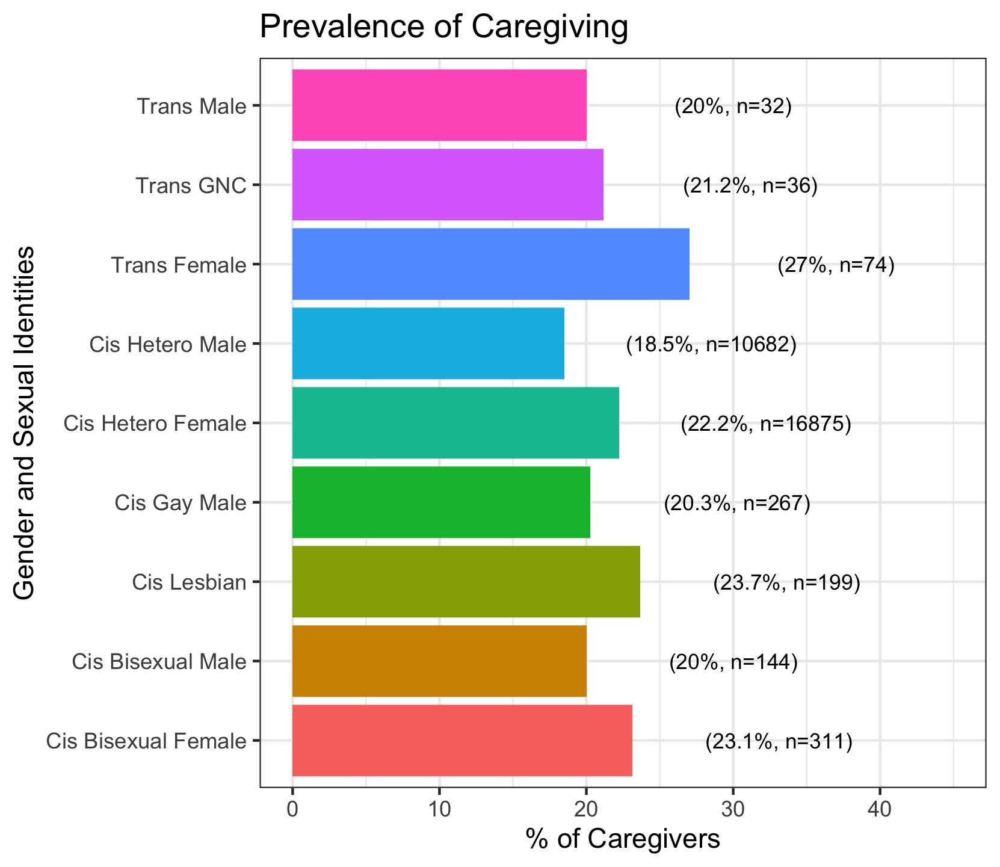

---


### No Statistically Significant Differences in Types of Care between SGM and Non-SGM

##__BUT__

### Significant differences in caregiving dynamics with more disaggregated SGM and Gender Categories for Hours and Relationship

---
class: inverse, middle, center
# Results - RQ2: MHQOL

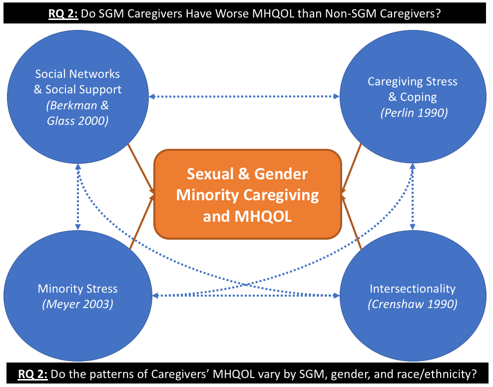

---
# Mental Health Questions

Health Related Quality of Life (HRQOL): days in last month of poor mental health QOL

_"Now thinking about your mental health, which includes stress, depression, and problems with emotions, for how many days during the past 30 days was your mental health not good?"_

- **Continuous**: Number of Days

- **Binary**:  ≥14 days

---
#SGM vs. Non-SGM Caregivers

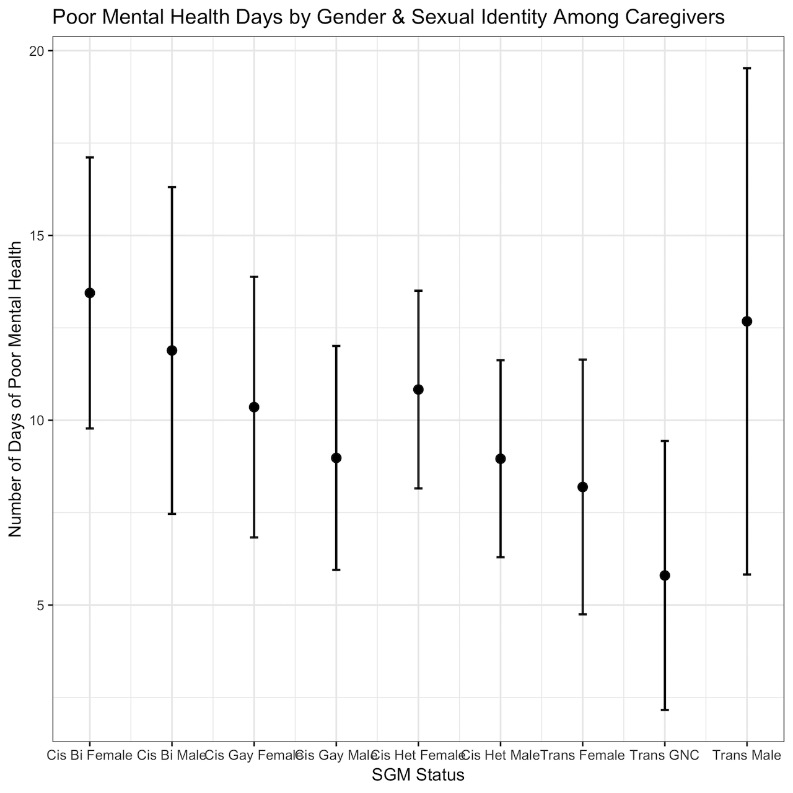

---

#Between Caregiver & SGM
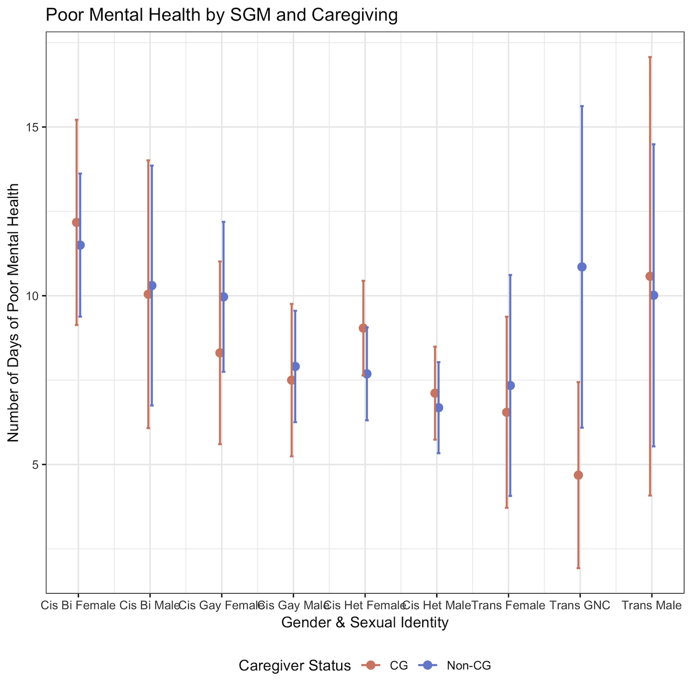


---
# Summary & Questions

- Sexual and Gender Minorities Caregive at Similar Rates
- Some differences in Hours and Relationship of Caregiver/Recipient
- SGM Caregivers have higher number of Poor MH Days
    - A function of SGM identity rather than CG
- Intersectionality and Sample Size Issues
- `brfssR`: data package with user-friendly, core health data

`r icon::fa("envelope")` [bcapistrant@smith.edu](mailto:bcapistrant@smith.edu) |
`r icon::fa("twitter")` [@bencapistrant](http://www.github.com/bencapistrant) |
`r icon::fa("github")` [brfssR](http://www.github.com/bencapistrant/brfssR)

 

Slides created via the R package [**xaringan**](https://github.com/yihui/xaringan).
